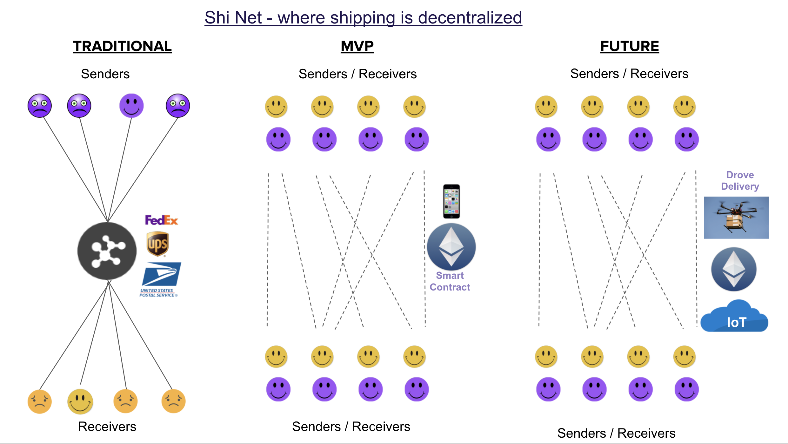

# Shi-Net (pronounced Shy Net)

ShiNet is a decentrlized shipping and social network built on Ethereum and powered by Moralis and Polygon Matic network.

The purpose of ShiNet is to democratize and decentralize shipping by directly connecting 
package senders with shippers without any need for intermediaries like FedEx, UPS, USPS or the like.

# Try it out:

https://dxskhuqre3qa.moralis.io/
