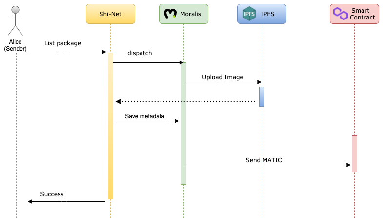
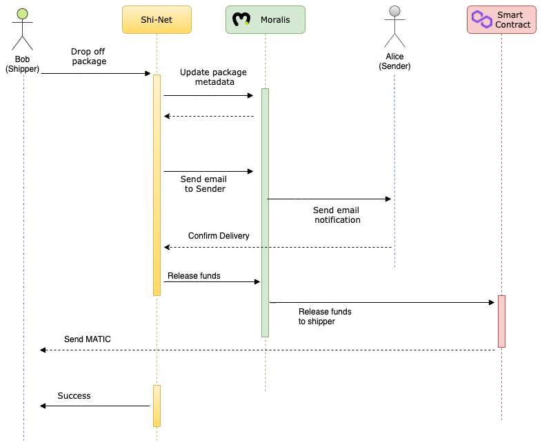

[](https://dxskhuqre3qa.moralis.io/)


# Shi-Net (pronounced Shy Net)

ShiNet is a decentrlized shipping and social network built on Ethereum and powered by Moralis and Polygon Matic network.

The purpose of ShiNet is to democratize and decentralize shipping by directly connecting 
package senders with shippers without any need for intermediaries like FedEx, UPS, USPS or the like.


# Try it out:

https://dxskhuqre3qa.moralis.io/

-----
<br/>

### 1. Sender lists a package on the platform:



<br/>

### 2. Shipper picks up the package:


<br/>

### 3. Package drop off and payment through smart contract:


<br/>

# Tech Stack:

```
Backend
    - Moralis    

Smart Contract
    - Solidity

Blockchain
    - Polygon (Matic) Mumbai Testnet

UI
    - Angular

    
```

# Moralis features used:

- Web hosting
- Objects
- Files
- User Management (Registration and Login)
- Sessions
- Live Queries
- Email
- Cloud Functions
- IPFS
- Various Crypto Functions (Web3)